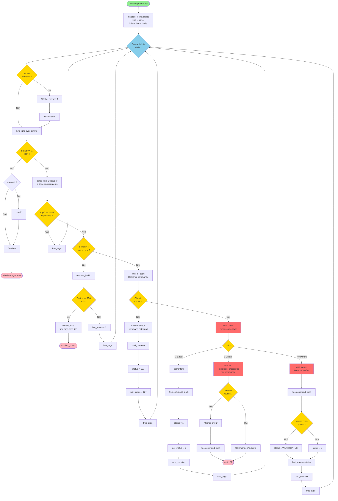

# Simple Shell - Flowchart

```mermaid
flowchart TD
    Start([Démarrage du Shell]) --> Init[Initialiser les variables<br/>line = NULL<br/>interactive = isatty]
    Init --> Loop{Boucle Infinie<br/>while 1}
    
    Loop --> CheckInteractive{Mode<br/>Interactif ?}
    CheckInteractive -->|Oui| ShowPrompt[Afficher prompt: $]
    CheckInteractive -->|Non| ReadLine
    ShowPrompt --> Flush[fflush stdout]
    Flush --> ReadLine
    
    ReadLine[Lire ligne avec getline] --> CheckEOF{nread == -1<br/>EOF ?}
    CheckEOF -->|Oui| PrintNewline{Interactif ?}
    PrintNewline -->|Oui| PrintNL[printf '\n']
    PrintNewline -->|Non| FreeLine
    PrintNL --> FreeLine[free line]
    FreeLine --> EndProgram([Fin du Programme])
    
    CheckEOF -->|Non| ParseLine[parse_line: Découper<br/>la ligne en arguments]
    ParseLine --> CheckNull{args0 == NULL<br/>Ligne vide ?}
    CheckNull -->|Oui| FreeArgs1[free_args]
    FreeArgs1 --> Loop
    
    CheckNull -->|Non| CheckBuiltin{is_builtin ?<br/>exit ou env ?}
    
    CheckBuiltin -->|Oui| ExecBuiltin[execute_builtin]
    ExecBuiltin --> CheckExit{Status == 256<br/>exit ?}
    CheckExit -->|Oui| HandleExit[handle_exit:<br/>free args, free line]
    HandleExit --> ExitShell([exit last_status])
    
    CheckExit -->|Non| UpdateStatus1[last_status = 0]
    UpdateStatus1 --> FreeArgs2[free_args]
    FreeArgs2 --> Loop
    
    CheckBuiltin -->|Non| FindPath[find_in_path:<br/>Chercher commande]
    FindPath --> CheckPath{Chemin<br/>trouvé ?}
    
    CheckPath -->|Non| PrintError[Afficher erreur:<br/>command not found]
    PrintError --> IncrementCmd1[cmd_count++]
    IncrementCmd1 --> SetStatus127[status = 127]
    SetStatus127 --> UpdateLast1[last_status = 127]
    UpdateLast1 --> FreeArgs3[free_args]
    FreeArgs3 --> Loop
    
    CheckPath -->|Oui| Fork[fork: Créer<br/>processus enfant]
    Fork --> CheckFork{pid ?}
    
    CheckFork -->|"-1" Erreur| Perror[perror fork]
    Perror --> FreePath1[free command_path]
    FreePath1 --> SetStatus1[status = 1]
    SetStatus1 --> UpdateLast2[last_status = 1]
    UpdateLast2 --> IncrementCmd2[cmd_count++]
    IncrementCmd2 --> FreeArgs4[free_args]
    FreeArgs4 --> Loop
    
    CheckFork -->|"0" Enfant| Execve[execve:<br/>Remplacer processus<br/>par commande]
    Execve --> CheckExec{execve<br/>réussit ?}
    CheckExec -->|Non| ErrorExec[Afficher erreur]
    ErrorExec --> FreePath2[free command_path]
    FreePath2 --> ExitChild([exit 127])
    CheckExec -->|Oui| RunCommand[Commande s'exécute]
    RunCommand --> ExitChild
    
    CheckFork -->|"> 0" Parent| Wait[wait status:<br/>Attendre l'enfant]
    Wait --> FreePath3[free command_path]
    FreePath3 --> CheckExited{WIFEXITED<br/>status ?}
    CheckExited -->|Oui| GetStatus[status = WEXITSTATUS]
    CheckExited -->|Non| SetStatus0[status = 0]
    GetStatus --> UpdateLast3[last_status = status]
    SetStatus0 --> UpdateLast3
    UpdateLast3 --> IncrementCmd3[cmd_count++]
    IncrementCmd3 --> FreeArgs5[free_args]
    FreeArgs5 --> Loop
    
    style Start fill:#90EE90
    style EndProgram fill:#FFB6C1
    style ExitShell fill:#FFB6C1
    style ExitChild fill:#FFB6C1
    style Loop fill:#87CEEB
    style CheckInteractive fill:#FFD700
    style CheckEOF fill:#FFD700
    style CheckNull fill:#FFD700
    style CheckBuiltin fill:#FFD700
    style CheckExit fill:#FFD700
    style CheckPath fill:#FFD700
    style CheckFork fill:#FFD700
    style CheckExec fill:#FFD700
    style CheckExited fill:#FFD700
    style Fork fill:#FF6B6B
    style Execve fill:#FF6B6B
    style Wait fill:#FF6B6B
```